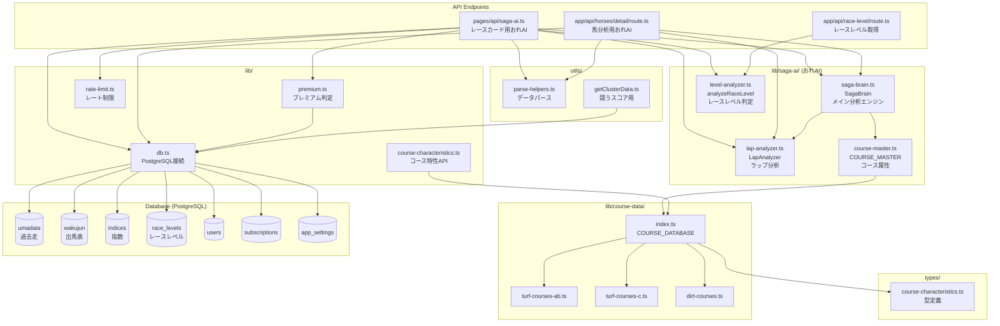
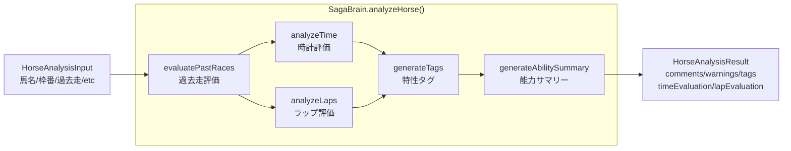
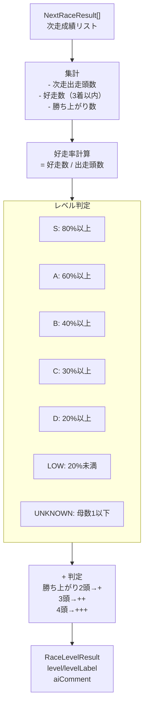
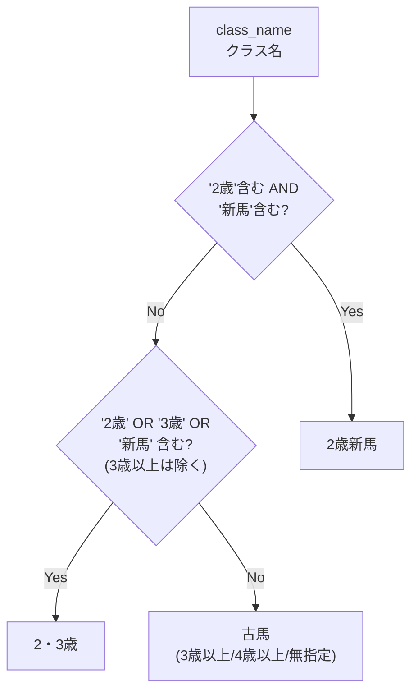
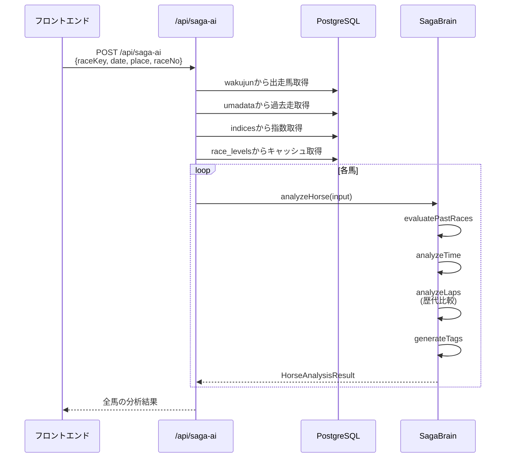

# racescore-web アーキテクチャ図

## 依存関係グラフ

## SagaBrain処理フロー

## レースレベル判定ロジック

## 年齢カテゴリ分類（ラップ比較用）

## データフロー: レースカード → おれAI

## 主要用語対応表

| UI表示 | コード参照 | ファイル |
|--------|-----------|----------|
| おれAI | `SagaBrain` | lib/saga-ai/saga-brain.ts |
| レースレベル | `RaceLevelResult` | lib/saga-ai/level-analyzer.ts |
| ラップ分析 | `LapAnalyzer` | lib/saga-ai/lap-analyzer.ts |
| 時計評価 | `analyzeTime()` | lib/saga-ai/saga-brain.ts |
| 特性タグ | `generateTags()` | lib/saga-ai/saga-brain.ts |
| 競うスコア | `getClusterData()` | utils/getClusterData.ts |

## DBカラム対応表

| 項目 | 新フォーマット | 旧フォーマット |
|------|---------------|---------------|
| 馬番 | umaban | horse_number |
| 頭数 | field_size | number_of_horses |
| ラップ | lap_time | work_1s |
| 4角 | corner_4 | corner_4_position |
| 複勝下限 | place_odds_low | ― |
| 複勝上限 | place_odds_high | ― |
